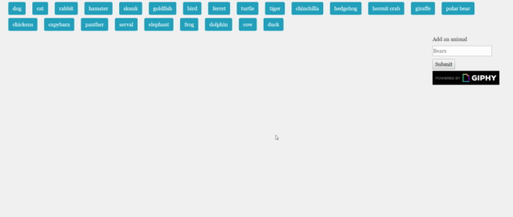

# [Giftastic](https://armonkahil.github.io/Giftastic/)

The purpose of this assignment was to demonstrate my knowledge of Ajax and APIs. When the page loads, there are a list of buttons generated at the top of the page from an array. Clicking of one of those buttons will then source the Giphy API for related gifs that load in the still format. Each image can then be animated by clicking on the image. If the user wanted to add and animal, they can do so and click on that button to see the new animal.

## [Giphy](https//www.gihpy.com)

